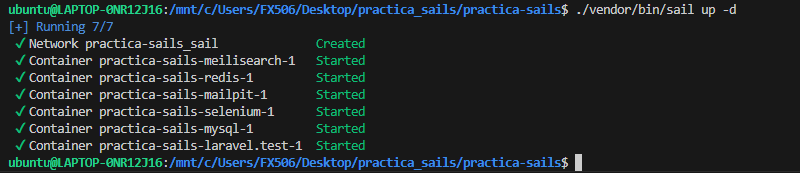
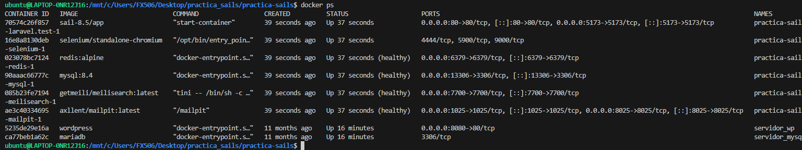
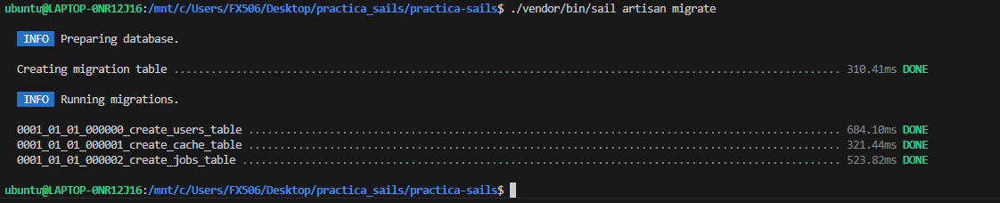
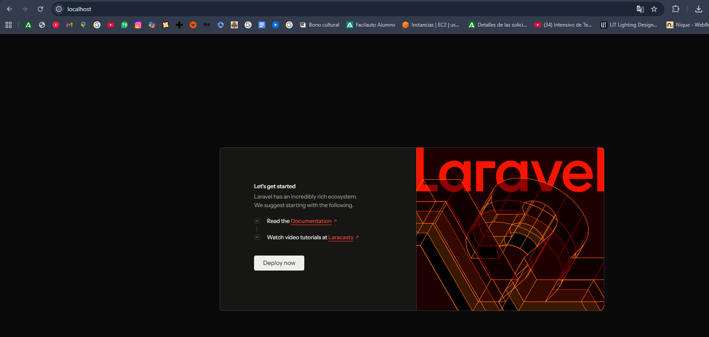
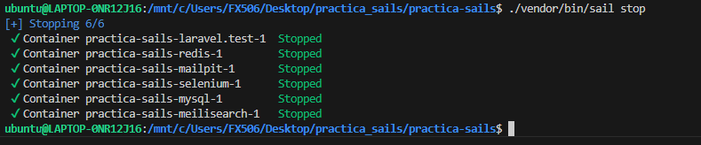
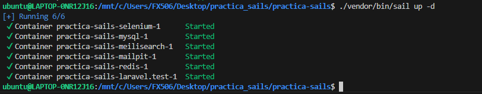
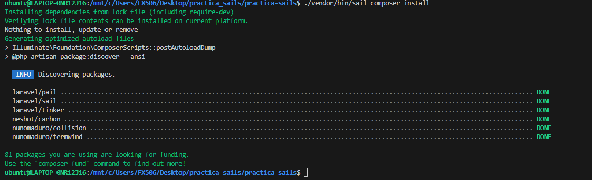
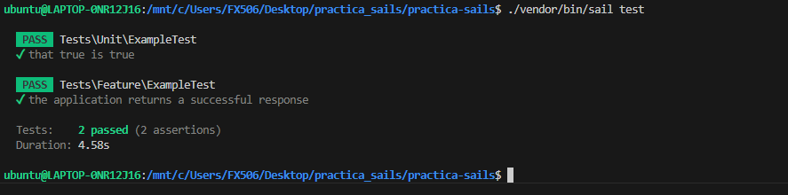

# Practica Laravel con Sails

<p align="left">

</p>

## Índice

1. [Creación del Scaffolding del Proyecto](#creación-del-scaffolding-del-proyecto)
2. [Configuración de Laravel Sail](#configuración-de-laravel-sail)
3. [Gestión de Servicios y Contenedores](#gestión-de-servicios-y-contenedores)
4. [Ejecución de Migraciones y Pruebas](#ejecución-de-migraciones-y-pruebas)
5. [Comandos Útiles de Mantenimiento](#comandos-útiles-de-mantenimiento)
6. [Si lo haces con podman en lugar de docker](#si-lo-haces-con-podman-en-lugar-de-docker)
---

## Creación del Scaffolding del Proyecto

Procederemos a crear el proyecto con el comando:
```bash
curl -s "https://laravel.build/practica-sails" | bash
```


## Configuración de Laravel Sail

Esto generará un nuevo proyecto de Laravel con Sail preconfigurado. Una vez creado, navegamos al directorio del proyecto:
```bash
cd practica-sails
```

Y lo iniciaremos en segundo plano con el comando:
```bash
./vendor/bin/sail up -d
```



## Gestión de Servicios y Contenedores

Veremos los contenedores en ejecución con:
```bash
docker ps
```


## Ejecución de Migraciones y Pruebas

Ejecutaremos las migraciones para configurar la base de datos:

```bash
./vendor/bin/sail artisan migrate
```



Probaremos la aplicación accediendo a `http://localhost` en el navegador, lo que debería mostrar la página de bienvenida de Laravel.



## Comandos Útiles de Mantenimiento
Para detener los contenedores:
```bash
./vendor/bin/sail stop
```


Para iniciar los contenedores nuevamente:
```bash
./vendor/bin/sail up -d
```


Para ejecutar comandos Composer dentro del contenedor:
```bash
./vendor/bin/sail composer install
```


Para hacer un test de la aplicación:
```bash
./vendor/bin/sail test
```



